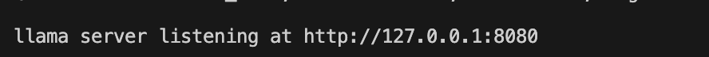

# AIPI561- Photo Search

## Project Purpose
The purpose of this project is to allow users to search for their photos in a more eficient way then is currently available through, example, Mac Photos-- an app that only allows users to search via photo title, location, date, or user-created description. Expanding search ability, on upload, the multimodal llamafile generates a description of the photo, allowing for a much more comprehensive search. 

## Architecture Diagram

## Application Setup/Run/Test Instructions
Set up and Run Application
1. To download and launch the llamafile locally, please run the following commands in your terminal: "chmod +x run_llamafile.sh" "./run_llamafile.sh". Note that if the llamafile is not let downloaded onto your device, this completion will take a couple of minutes. 
You should see the following statement if step one correctly executed 
2. Once the llamafile is running on localhost:8080, run "docker-compose build" "docker-compose up" to build the docker images for the frontend and backend of the application. 
3. navigate to http://localhost:3000 

Unit Tests:
To run unit tests, please run the command "make test"