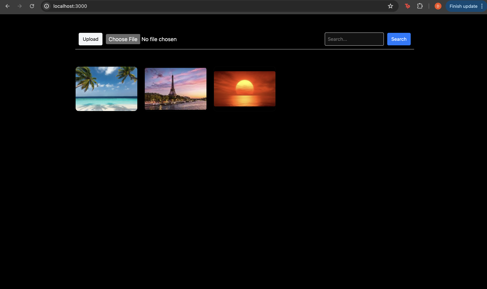
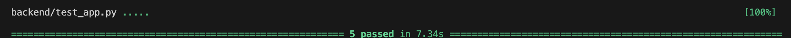

# AIPI561- Photo Search
[](https://github.com/dominiquebuford/561-project/actions/workflows/cicd.yaml)

## Project Purpose
The purpose of this project is to allow users to search for their photos in a more eficient way then is currently available through, example, Mac Photos-- an app that only allows users to search via photo title, location, date, or user-created description. Expanding search ability, on upload, the multimodal llamafile generates a description of the photo, allowing for a much more comprehensive search. 

## Architecture Diagram

## Application Setup/Run/Test Instructions
Set up and Run Application
1. Clone this repository
```sh
git clone https://github.com/dominiquebuford/561-project.git
```
2. Change current directory to cloned directory
```sh
cd 561-project
```
3. Download and launch llamafile locally: 
```sh 
chmod +x run_llamafile.sh
./run_llamafile.sh 
```
 Note that if the llamafile is not let downloaded onto your device, this completion will take a couple of minutes. The automated opening for the llamafile browser window has been disabled to avoid unnecessary tabs but you can navigate to http://localhost:8080 to interact with the built-in chat interface.
You should see the following statement if step one correctly executed: 
4. Build docker images for the frontend and backend of the application:
```sh
 docker-compose build 
 docker-compose up
 ```
5. navigate to http://localhost:3000 to interact with the application. 

Unit Tests:
To run unit tests, please run the command "make test". 5 Tests should be showing as passing
